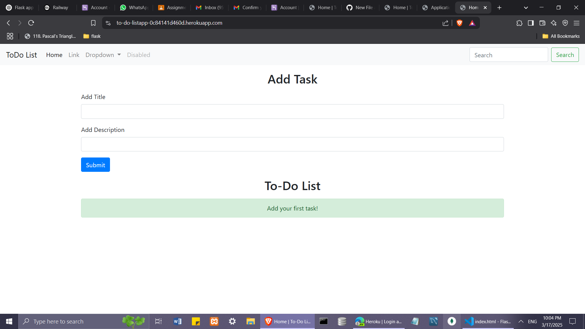
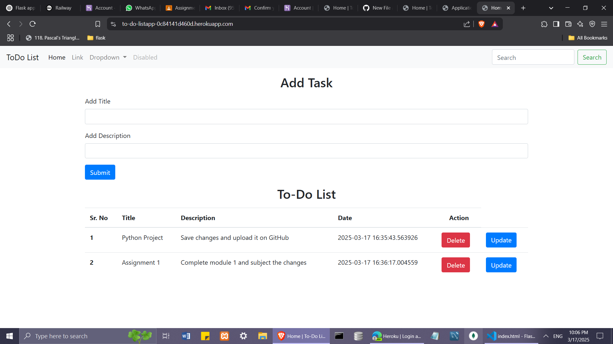

# 📝 To-Do List App (Flask) 

A simple To-Do List web application built using **Flask** and **SQLite**. Users can add, delete, and manage their tasks easily.

## 🏆 My First Flask Project!

This is my first web application built using Flask. I plan to improve it further by adding more features and UI enhancements.

## 🚀 Preview

🔗 **Live App:** [To-Do List App](https://to-do-listapp-0c84141d460d.herokuapp.com/)

---

## 📷 Screenshots

### 🖥️ Homepage  

### ✅ Task Added

---

## 📌 Features
✅ Add tasks with title and description  
✅ View all added tasks in a structured format  
✅ Delete tasks when completed  
✅ **Upcoming Enhancements:**
   - 🔍 Search functionality for tasks  
   - ✅ Success and alert messages for actions  
   - 📌 Fully functional navigation bar  

---

## 🛠️ Technologies Used
- **Backend:** Flask (Python)
- **Database:** SQLite
- **Frontend:** HTML, CSS, Bootstrap

---

## 🛠️ Installation & Setup  

### 1️⃣ Clone the Repository  

git clone [https://github.com/your-username/Flask.git]
cd Flask

### 2️⃣ Create and Activate a Virtual Environment

python -m venv env  
env\Scripts\activate  

### 3️⃣ Install Dependencies

pip install -r requirements.txt  

### 4️⃣ Set Up Database

python  
>>> from app import db  
>>> db.create_all()  
>>> exit()  

### 5️⃣ Run the Application

python app.py  

App will be available at http://127.0.0.1:5000/.

---

## 📩 Contact
💡 Suggestions & feedback are welcome!
📧 Email: ayushirahane2021@gmail.com
🔗 GitHub: Ayushi-Rahane

